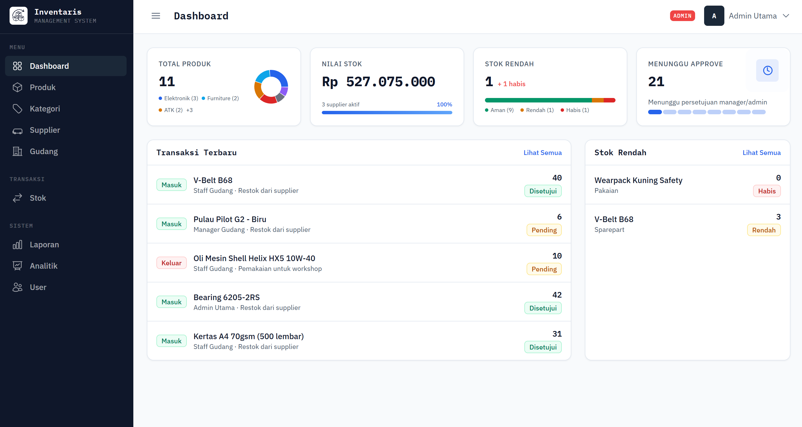
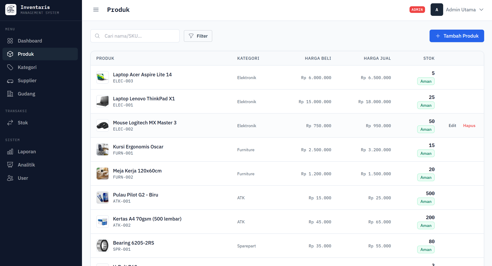
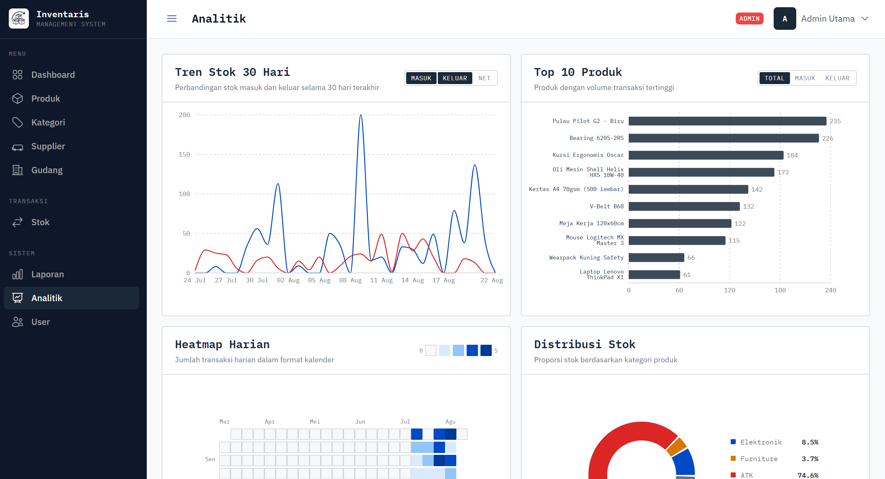

<div align="center">

# KINETIC
### Sistem Manajemen Inventaris Gudang

Aplikasi web untuk mengelola stok barang, transaksi masuk/keluar, supplier,
dan laporan inventaris secara real-time.


</div>

---

## Tentang Project

KINETIC adalah sistem manajemen inventaris gudang berbasis web yang dibangun sebagai Tugas Akhir UKM Progress 2026. Sistem ini mendukung pencatatan stok masuk/keluar, alur persetujuan transaksi, analitik real-time, dan kontrol akses berbasis role untuk empat jenis pengguna.

## Screenshot
<div align="center">
  
  <p><em>Dashboard : ringkasan stok real-time</em></p>
</div>

<div align="center">
  
  <p><em>Halaman Produk : daftar produk</em></p>
</div>

<div align="center">
  
  <p><em>Halaman Analitik : tren stok 30 hari</em></p>
</div>

## Tech Stack

| Layer | Teknologi |
|---|---|
| **Backend** | Laravel 13 (PHP 8.3+) |
| **Frontend** | React 18 + Inertia.js v2 |
| **Styling** | Tailwind CSS v3 |
| **UI Components** | Headless UI React |
| **Database** | MySQL 8.0 + Eloquent ORM |
| **Auth** | Laravel Breeze (Inertia + React) |
| **Charts** | Recharts |
| **Routes (JS)** | Ziggy |
| **Testing** | Pest |
| **Build Tool** | Vite 8 |

## Fitur

- **Dashboard** — statistik ringkasan stok, transaksi, dan alert stok minimum
- **Produk** — CRUD produk dengan foto, SKU unik, zona gudang, harga beli/jual
- **Kategori** — pengelompokan produk berdasarkan kategori
- **Supplier** — pengelolaan data supplier dengan status aktif/nonaktif
- **Gudang** — tampilan zona gudang untuk distribusi stok
- **Transaksi Stok** — pencatatan stok masuk, keluar, dan penyesuaian dengan alur approval
- **Laporan** — laporan stok dengan filter periode
- **Analitik** — tren stok 30 hari, top produk, heatmap harian, distribusi kategori
- **Manajemen User** — CRUD user dengan role-based akses (admin only)
- **Profil** — pengaturan profil dan ubah password

## Role & Permission

| Fitur | Admin | Manager | Staff | Viewer |
|---|:---:|:---:|:---:|:---:|
| Kelola User | ✅ | ❌ | ❌ | ❌ |
| CRUD Produk | ✅ | ✅ | ✅ | ❌ |
| CRUD Kategori | ✅ | ✅ | ✅ | ❌ |
| CRUD Supplier | ✅ | ✅ | ❌ | ❌ |
| Input Transaksi | ✅ | ✅ | ✅ | ❌ |
| Approve Transaksi | ✅ | ✅ | ❌ | ❌ |
| Lihat Laporan | ✅ | ✅ | ❌ | ❌ |
| Analitik | ✅ | ✅ | ❌ | ❌ |
| Lihat Dashboard | ✅ | ✅ | ✅ | ✅ |

## Instalasi

### Prasyarat

Pastikan sudah terinstall di komputer kamu:

- PHP 8.3+
- MySQL 8.0+
- Node.js 20+
- Composer

### Langkah Setup

**1. Clone repository**
```bash
git clone https://github.com/[username]/kinetic-inventory.git
cd kinetic-inventory
```

**2. Install dependencies**
```bash
composer install
npm install --legacy-peer-deps
```

**3. Setup environment**
```bash
cp .env.example .env
php artisan key:generate
```

**4. Konfigurasi database**

Buka file `.env` lalu sesuaikan:
```env
DB_DATABASE=web_tugasakhir
DB_USERNAME=root
DB_PASSWORD=
```

**5. Jalankan migration & seeder**
```bash
php artisan migrate
php artisan db:seed
```

**6. Jalankan development server**

Buka dua terminal secara bersamaan:
```bash
# Terminal 1
php artisan serve
# → http://localhost:8000

# Terminal 2
npm run dev
# → Vite dev server (HMR)
```

### Akun Bawaan (Seeder)

| Role | Email | Password |
|---|---|---|
| Admin | admin@inventaris.test | password |
| Manager | manager@inventaris.test | password |
| Staff | staff@inventaris.test | password |
| Viewer | viewer@inventaris.test | password |

> ⚠️ Akun di atas hanya untuk keperluan development/demo. Ganti password sebelum deploy ke production.

## Struktur Database

```
users
├── id, name, email, password, role, is_active, last_active_at

categories
├── id, name, description

suppliers
├── id, name, email, phone, address, status

products
├── id, category_id (FK), supplier_id (FK)
├── name, sku (unique), photo
├── buy_price, sell_price, stock_quantity, min_stock
├── zone, created_by (FK)

stock_transactions
├── id, product_id (FK), user_id (FK)
├── type (in/out/adjustment)
├── quantity, note
├── status (pending/approved/rejected)
├── approved_by (FK), approved_at
```

## Struktur Proyek

```
app/
├── Http/
│   ├── Controllers/        # 10 Controllers
│   ├── Middleware/         # RoleMiddleware
│   └── Requests/           # Form Request Validation
├── Models/                 # User, Category, Product, Supplier, StockTransaction
└── Services/               # Business logic

resources/js/
├── Pages/                  # 30 halaman React (Inertia)
├── Components/             # AppLayout, Sidebar, DataTable, dll.
└── hooks/                  # usePermission, useFlash

database/
├── migrations/             # 8 migration files
└── seeders/

routes/
├── web.php
└── auth.php
```

## Perintah Berguna

```bash
# Development
php artisan serve
npm run dev

# Database
php artisan migrate
php artisan db:seed
php artisan migrate:fresh --seed   # reset & seed ulang

# Generate file
php artisan make:model NamaModel -mfsc
php artisan make:request NamaRequest

# Cache (production)
php artisan config:cache
php artisan route:cache
php artisan view:cache

# Testing
php artisan test
```

## Lisensi

Didistribusikan di bawah [MIT License](LICENSE).
